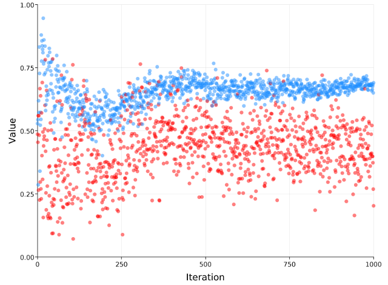

# Monty Hall
Monty Hall was a television host for the game show "Let's Make a Deal".  A
contenstant is given the choice between 3 doors.  Two of them contain a goat,
one of them a car.  When she has chosen a door, the host opens one of the two
remaining doors.  The contestant is then given the option to choose the
remaining door instead of the one she originally selected.

The solution to the problem is not intuitively clear.  The correct solution is
well-known (`SWITCH`), though this does require some mathematical reflection.
For this example, we consider an agent that considers both `SWITCH` and
`REMAIN` as viable options.  We want it to learn by playing the game, i.e. by
choosing a strategy.

Each option has an (a priori unknown) win rate.  We model this by drawing the
win rate for each strategy from a distribution.  Then, as games are played out
and wins & losses are accumulated for each strategy, the posterior distribution
of the win rate simply tells us which strategy is better.

## Multi-armed bandit
The challenge now is to find the best strategy with minimal regret, i.e. to
minimize the number of times the wrong strategy is chosen.  This is a classical
example of the multi-armed bandit, where exploration (testing out alternative
strategies) is balanced with exploitation (use the so-far best performing
strategy).  We'll use the simplest way to do this, using the posterior
distribution that is based on the data that has already been collected.  

In Thompson sampling, the win rate of each "arm" is drawn from its posterior.
The arm with the highest rate is then used to play.

## Streaming (variational) inference
One of the attractive properties of variational inference is that it gives us a
very simple posterior distribution, one that we can use as a prior when
observing new data.

A naive way of doing this would be to run variational inference until
convergence whenever a new data point comes in and then replace the prior with
(the approximation to) the posterior.  However, this would be expensive - a lot
of computation is done for a single data point.

Instead, we'll use a more sophisticated approach where we keep a history of the
last $N$ games.  After each game, the prior is adjusted to the posterior at a 
learning rate of $1/N$.  This gives each game $N$ evaluations to contribute to
the learned parameters.  A large $N$ will result in accurate updates, but the
lower learning rate means a lot of regret is built up in early games.  A small
$N$ has the risk of updating the distribution parameters before convergence, so
it could very easily learn the wrong parameters.

## Strategies and history
Let's start by defining the strategies / actions that can be taken:
```scala
sealed trait Strategy
case object Switch extends Strategy
case object Remain extends Strategy

var history = Seq.empty[(Strategy, Boolean)]
```
The history remembers whether an action led to a win or a loss in a particular
game.

Each strategy will have an associated probability density that describes the
belief its win ratio has a particular value.

## The model
In the model, we'll draw samples from the distributions 

### Play a game
For each sample a new game is played, which will be added to the history.
Behind one of three doors there is a prize, the others contain a dud.
The contestant picks a door (we'll assume door `0`).  Subsequently, Month
will open one of the remaining doors that does not contain the prize.
```scala
// put price behind random door, assume contestant picks the first door
val doorWithPrice = Random.nextInt(3)
val selectedDoor = 0

// let monty open one of the remaining doors
val montyOptions = doors.filter { door =>
  door != doorWithPrice && door != selectedDoor
}
val montyOpens = montyOptions(Random.nextInt(montyOptions.size))
```

### Select a strategy
For each of the strategies, we sample the probability of winning from the prior
distribution:
```scala
// sample probabilities of winning for both strategies
val p_switch = sigmoid(sample(switch.prior, switch.guide))
val p_remain = sigmoid(sample(remain.prior, remain.guide))
```
use these to determine which strategy to use and observe the result (did the
contestant win the prize?):
```scala
if (p_switch.v > p_remain.v) {
  val switchedDoor = doors.filter { door =>
    door != selectedDoor && door != montyOpens
  }.head
  val haveWon = switchedDoor == doorWithPrice
  observe(Bernoulli(p_switch), haveWon)
} else {
  val haveWon = selectedDoor == doorWithPrice
  observe(Bernoulli(p_remain), haveWon)
}
```

### Observe history
While we draw probabilities from the prior, we need to observe the history
to incorporate it into the posterior.
```scala
for {(strategy, result) <- history} {
  strategy match {
    case Switch => observe(Bernoulli(p_switch), result)
    case Remain => observe(Bernoulli(p_remain), result)
  }
}
```

## Update prior
For both strategies, we keep track of a prior and a guide.  The prior initially
is flat, considering each win ratio to be as likely.  But when samples glide
out the window on history, their contribution to the posterior should be folded
into the updated prior.

For each strategy, we keep track of the parameters for the prior and the guide.
When a sample slides out of the history, the prior is updated.  The learning
rate (`lr`) is equal to $1/N$.
```scala
class State {
  private var prior_pos: Double = 0.0
  private var prior_var: Double = 0.0
  private val posterior_pos = optimizer.param(0.0)
  private val posterior_var = optimizer.param(0.0)

  val guide = ReparamGuide(Normal(posterior_pos, exp(posterior_var)))

  def prior = Normal(prior_pos, exp(prior_var))

  def updatePrior(lr: Double): Unit = {
    prior_pos += (posterior_pos.v - prior_pos) * lr
    prior_var += (posterior_var.v - prior_var) * lr
  }
}
```

## Learning the win rates
Running this reinforcement learning algorithm for a thousand samples shows us 
clearly which strategy is better.  With `switch` in blue and `remain` in red,
we can see that `switch` is quickly preferred.  Being preferred learns to quick
convergence on the actual winning probability ($2/3 = 0.6666...$).  The losing
strategy (`remain`) does not learn much after it is clear that it is, indeed,
the losing strategy.

